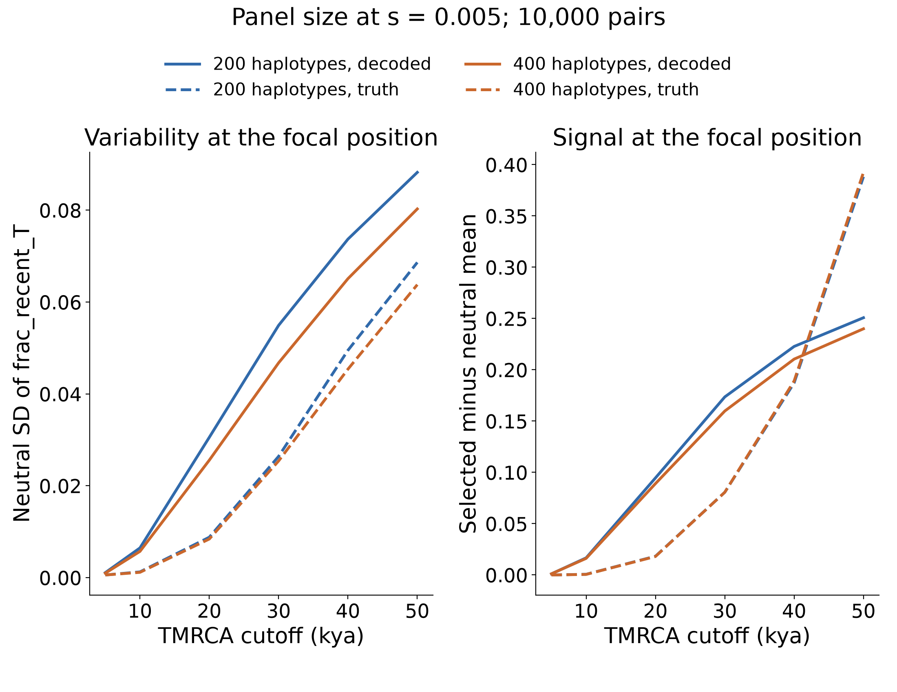
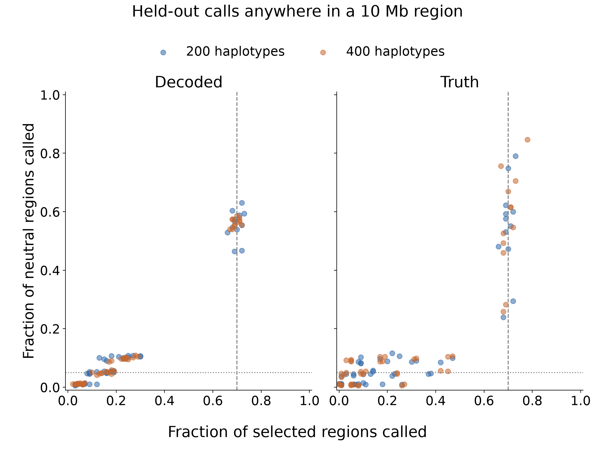

# Results from 400 versus 200 EAS haplotypes

Increasing the panel to 400 haplotypes produces modest smoothing of the decoded
`frac_recent_T` profile, but does not consistently improve the fraction of
selected regions called relative to neutral regions called. It does not achieve
approximately 70% sensitivity with a low neutral-region call rate.

All 1,100 new simulations completed without a simulation failure: 100 selected
at s=0.005 and 1,000 neutral. Both panels use 10,000 pairs, the same fixed
mutation/recombination rates, 2% introgression and selection onset at 50 kya,
the same decoder and SLiM binaries, and identical pinned software versions.
The larger panel contains 200 diploid individuals. Existing fresh 200-haplotype
simulations supply the comparison; the new panel was regenerated, not obtained
by nesting samples of a saved genealogy.

All selected replicates remain in evaluation. The 200-haplotype panel had one
sample-fixed allele; none was sample-fixed among the 400-haplotype replicates.
Mean selected allele frequency was 0.7867 versus 0.7839, respectively. These
similar distributions do not suggest a large change in sweep strength between
the evaluated panels.

## Variability and decoding error

The table measures standard deviation across neutral replicates separately at
each position, then averages those SDs over the 10 Mb region. This is distinct
from the standard deviation at the single focal coordinate.

| TMRCA cutoff | Mean position SD, 200 haplotypes | Mean position SD, 400 haplotypes | Reduction |
|---:|---:|---:|---:|
| 5 kya | 0.001067 | 0.000968 | 9.3% |
| 10 kya | 0.006069 | 0.005744 | 5.4% |
| 20 kya | 0.026843 | 0.026261 | 2.2% |
| 30 kya | 0.049107 | 0.048350 | 1.5% |
| 40 kya | 0.067913 | 0.067034 | 1.3% |
| 50 kya | 0.083206 | 0.082191 | 1.2% |

At the focal coordinate, decoded neutral SD decreases by about 9–16% across
these cutoffs. The smaller region-wide changes are more relevant to the
question of whether the whole scan becomes quieter. Average absolute changes
between neighboring strides decrease by 7.6% at T=10 kya and 2.1% at T=50 kya.
This roughness metric contains genuine genealogical variation as well as error.

Decoded-versus-true `frac_recent_50000` RMSE, calculated within each region and
then averaged across neutral replicates, changes only from 0.07382 to 0.07303,
about a 1.1% reduction. The selected-region reduction is about 1.0%. Thus, the
larger panel does not substantially remove aggregate decoding error.

## Same calling rules on both panels

Each cell below reports **selected regions called / neutral regions called**.
The denominators are 100 selected and 1,000 neutral on each side. A call anywhere
in the 10 Mb region counts, without a distance-to-allele requirement.

| Rule | 200 haplotypes | 400 haplotypes |
|---|---:|---:|
| Decoded T=10 kya; p<=0.01; 20 kb stride; 3 consecutive significant strides | 71% / 49.6% | 68% / 51.1% |
| Decoded T=50 kya; p<=0.001; 10 kb stride; 5 consecutive significant strides | 7% / 3.1% | 17% / 3.4% |
| True TMRCA; same T=50 kya, p<=0.001, 5-stride rule | 35% / 2.4% | 34% / 3.7% |
| Decoded T=50 kya; p<=0.001; 10 kb stride; at least 1 significant stride | 42% / 34.2% | 57% / 32.6% |

Some decoded T=50 kya rules improve. The earlier rule near 70% selected
sensitivity does not. These changes are not uniform across cutoffs and run
requirements, and the selected sample size is only 100 per panel. An improvement
under one rule should not be interpreted as a confirmed general improvement from
increasing panel size.

## Held-out regional calibration

The common validation procedure fits on 400 neutrals, calibrates on another
400, and evaluates on 200 held-out neutrals per fold. Each fold also holds out
20 selected regions. All five folds are pooled below. The score is the maximum
unstandardized `frac_recent_T` anywhere in the region, with a nominal regional
alpha of 0.05. Truth and decoding each use their own matched null calibration.

| Score | 200 haplotypes: selected / neutral | 400 haplotypes: selected / neutral |
|---|---:|---:|
| Decoded T=10 kya | 19% / 5.1% | 18% / 4.5% |
| Decoded T=20 kya | 19% / 5.6% | 19% / 5.5% |
| Decoded T=50 kya | 9% / 5.3% | 14% / 4.9% |
| True TMRCA, T=50 kya | 38% / 4.7% | 45% / 5.5% |

The observed error rates fluctuate around the nominal level. At this low error
level, decoded sensitivity remains far below 70%. A separate policy that trains
the T=10 kya raw maximum threshold to call at least 70% of training selected
regions yields 69% selected / 46.4% neutral for 200 haplotypes and 68% / 54.0%
for 400. It therefore does not show the desired improvement either.

Each cutoff and score is evaluated separately. Choosing a winner from the full
grid is exploratory. The folds and calibration split here are common to this
panel-size comparison and differ from the earlier 50-method cross-validation;
those older numbers should not be treated as the control for this procedure.

These results are consistent with a limited reduction in sampling variability,
while substantial shared decoding error and genuine genealogical variation
remain. That is an interpretation of this comparison, not a full decomposition
of its error sources. The experiment keeps the number of pairs fixed; it does
not test increasing both haplotypes and pair count.

## Files and checks

- [All matched threshold/stride/run comparisons](results/eas_h400/comparison/paired_grid_panel_comparison.csv).
- [All held-out region-call summaries](results/eas_h400/comparison/region_calls.csv).
- [Profile variability](results/eas_h400/comparison/profile_diagnostics.csv) and [decoded error](results/eas_h400/comparison/decoded_error.csv).
- [Methods and clone/pull/run commands](eas_h400.md).

Eleven focused tests passed. Input profiles were validated against completion
receipts. An independent audit checked 1,188,000 unique paired-grid rows and
211,200 unique held-out predictions, recomputing all 3,240 and 384 respective
summary call fractions. Output checksums passed. The main figures were visually
inspected and are available in PNG and editable-text vector PDF formats.

A dispatch-only restart replaced slow recursive disk scans with conservative
whole-volume accounting after all 84 started replicates had finished. No
in-progress simulation was discarded. The restart log and detailed simulation
data remain under `D:/phase2simselection/sim/eas_q02_h400`.
