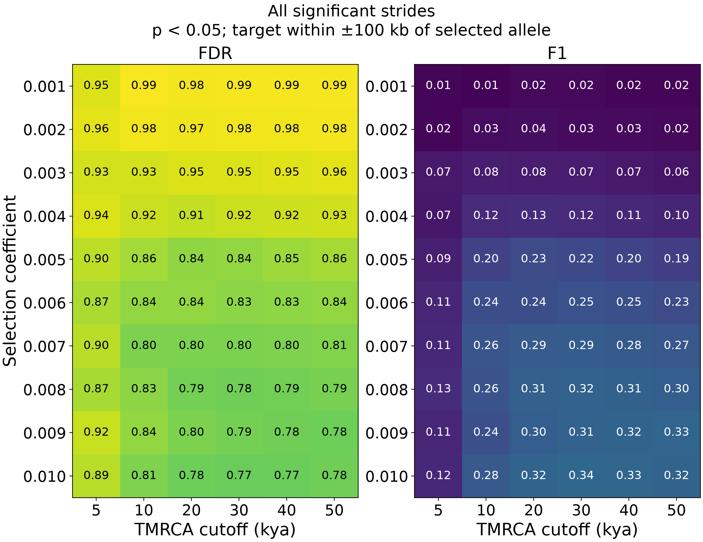

# Fresh EAS regional FDR and F1

The complete fresh study contains 1,000 neutral and 1,000 selected simulations
(100 per s from 0.001 through 0.010). All use immediate selection onset and
introgression at 50 kya. The columns below vary the TMRCA cutoff in the decoded
`frac_recent_T` statistic, not the selection onset.

At an unadjusted per-stride p < 0.05, regional specificity is poor despite high
focal-site power. Each selected region contains one target at 5 Mb; for these
localization scores, significant positions inside ±100 kb are true positives,
and positions outside are false positives. This interval is an explicit scoring
convention, not an inferred causal footprint of selection.

For the strongest arm, s = 0.010:

| TMRCA cutoff | Stride FDR | Stride F1 | Five-stride peak FDR | Five-stride peak F1 | Neutral regions with any significant stride |
|---:|---:|---:|---:|---:|---:|
| 5 kya | 89.4% | 0.117 | 82.3% | 0.153 | 96.0% |
| 10 kya | 80.5% | 0.279 | 79.0% | 0.302 | 99.2% |
| 20 kya | 78.1% | 0.322 | 80.3% | 0.294 | 99.7% |
| 30 kya | 77.0% | 0.335 | 77.3% | 0.340 | 100.0% |
| 40 kya | 77.5% | 0.331 | 74.9% | 0.377 | 100.0% |
| 50 kya | 78.4% | 0.317 | 72.9% | 0.389 | 100.0% |

These FDR and F1 estimates average across all 100 selected replicates in the arm;
no-call replicates contribute zero to both. The selected simulations are
conditioned on allele survival and sample observation, including sample AF=1.
The full [selected summary](results/fresh_eas_region/selected_summary.csv)
includes every arm, both thresholds, all target widths, pooled-count metrics,
and bootstrap intervals. At s=0.010 and T=50 kya, the primary stride FDR has a
95% bootstrap interval of 76.3–80.4%; F1 has an interval of 0.290–0.343.

Five-stride peaks merge only consecutive significant positions, and at most one
peak is matched to the single selected locus. Requiring at least five positions
does not suffice at p < 0.05: 88.2–97.1% of neutral regions still emit a peak,
depending on T. At T=50 kya, the rate is 95.4%, with 3.485 peaks per neutral region
on average.

Tightening to p < 0.01 and requiring five consecutive positions improves the
strongest arm at T=50 kya to 71% target detection, FDR 39.2%, and F1 0.553.
However, 39.7% of neutral regions still emit a peak, averaging 0.530 per region.
This operating point does not provide low regional false-positive rates.
The complete [neutral summary](results/fresh_eas_region/neutral_summary.csv)
reports call rates and counts for every T and threshold.

Target width matters: at s=0.010, T=50 kya and p<0.05, stride FDR is 85.5%, 78.4%,
71.1%, and 65.7% for ±50, ±100, ±250, and ±500 kb. Some flanking signal can be
caused by the focal sweep, so these are localization-error estimates under each
target convention. The wholly neutral call rates do not require that convention.

Per-position p-values use the 1,000 neutral replicates at the corresponding
position. Neutral evaluation removes the tested replicate from its reference.
No positions are treated as independent simulations, and no genome-wide FDR
claim or biological prevalence assumption is made. See the
[methods and reproducible analysis command](fresh_eas_region_metrics.md).

Validation checked all 2,000 decoded profile hashes and contents, reproduced
all 6,000 earlier focal p-values, and passed four focused tests covering ties,
position-specific nulls, no-call scores, and peak matching. Plots were visually
inspected and are available as editable-text vector PDFs alongside the PNGs.
