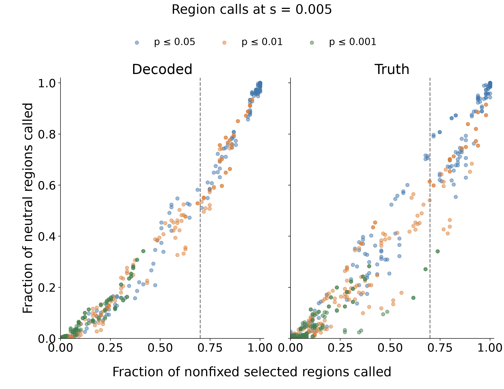
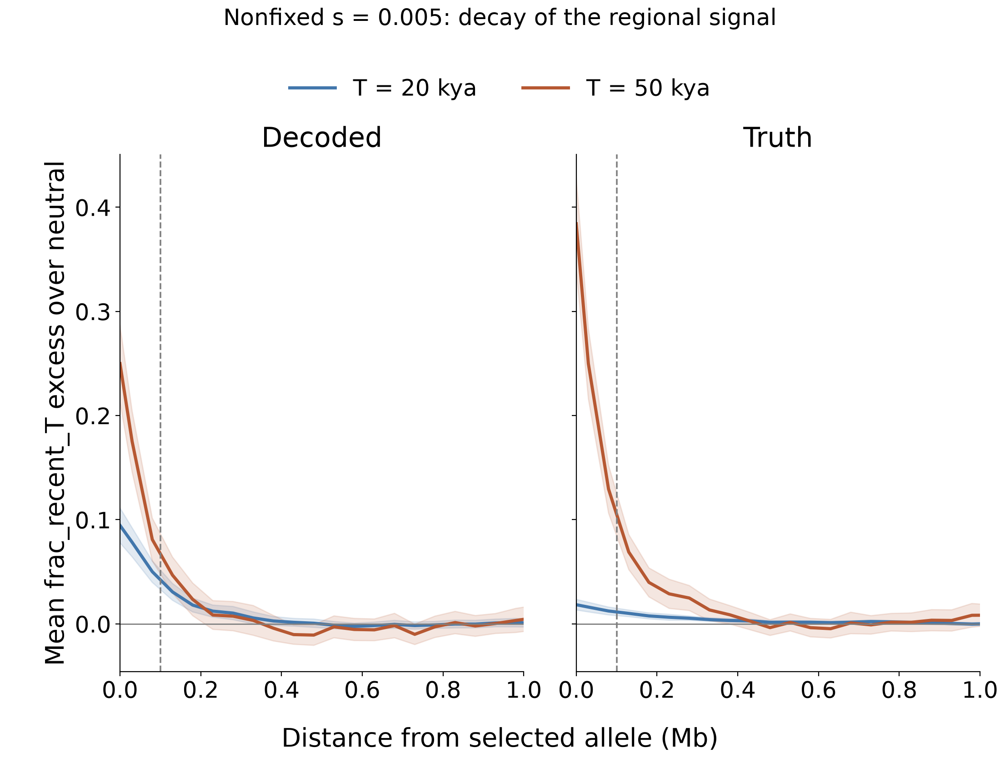

# Selected versus neutral 10 Mb region calls

The primary endpoint is identical on both sides: whether the entire 10 Mb
region has at least one qualifying call, anywhere. The comparison uses all 100
fresh EAS s=0.005 selected regions, including the one sample-fixed allele, and
1,000 fresh neutral regions. Results for the 99 nonfixed samples are separate.
No new simulations were generated for this analysis.

| Rule | Selected regions called | Neutral regions called |
|---|---:|---:|
| Decoded T=10 kya; p≤0.01; 20 kb reporting stride; ≥3 consecutive significant strides | 71/100 (71%) | 496/1000 (49.6%) |
| Decoded maximum standardized frac_recent_10000; internally cross-validated candidate | 70/100 (70%) | 448/1000 (44.8%) |
| True TMRCA, T=50 kya; p≤0.001; 10 kb reporting stride; ≥1 significant stride | 74/100 (74%) | 341/1000 (34.1%) |
| Same p≤0.001 rule using decoded statistics | 42/100 (42%) | 342/1000 (34.2%) |

The simple decoded rule approaching 70% sensitivity still calls about half of
neutral regions. The maximum-score candidate improves that to 44.8%, a modest
change that remains a high error rate. It was highlighted after comparing the
predefined candidate set, so selecting it for follow-up is exploratory.

The stricter evaluation chooses both method and threshold independently within
each training fold. That adaptive procedure produces 66/100 selected and
458/1000 neutral calls when targeting 70% training sensitivity. Targeting 80%
in training produces 74/100 selected and 581/1000 neutral calls. The fixed
cross-validated baseline (decoded T=10 kya, p<0.01, 10 kb, five consecutive
strides) produces 73/100 selected and 503/1000 neutral calls. Each test fold is
excluded from normalization, fitting, threshold selection and method choice.

The candidate's nonfixed-only call rate is 70/99 (70.7%). The corresponding
adaptive rates are 65/99 (65.7%) and 73/99 (73.7%). These are internal estimates
from previously summarized simulations, not independent confirmation.

## The p=0.001 comparison

With a 10 kb reporting stride and five consecutive significant strides, the
fractions of entire regions called are:

| TMRCA cutoff | Decoded selected | Decoded neutral | True selected | True neutral |
|---:|---:|---:|---:|---:|
| 5 kya | 9% | 6.2% | 5% | 3.6% |
| 10 kya | 22% | 7.9% | 6% | 4.9% |
| 20 kya | 16% | 7.2% | 11% | 4.3% |
| 30 kya | 13% | 5.6% | 12% | 4.1% |
| 40 kya | 8% | 3.5% | 15% | 3.7% |
| 50 kya | 7% | 3.1% | 35% | 2.4% |

This reduces neutral calls but does not maintain 70% selected sensitivity. The
gap between true and decoded statistics is large at T=50 kya under the identical
calling rule. The full grid has 540 rules per source: six T cutoffs, three alpha
values, three reporting strides, two gap allowances, and five run requirements.

Among these simple rules, restricting the observed neutral call fraction to at
most 5% gives a maximum selected call fraction of 20% for decoded statistics and
36% for true statistics. At a 10% neutral budget, the corresponding maxima are
25% and 47%. These are exploratory grid frontiers, not universal power bounds.

The paired grid uses inclusive p≤alpha. The neutral replicate is removed from
its own reference: its minimum rank is 1/1000 and the selected minimum is
1/1001. No p-values are zero. The p=0.001 tail estimate is resolution-limited.
Reporting-stride comparisons subsample the saved 10 kb profiles.

## Signal decay and interpretation

Mean excess signal extends beyond ±100 kb and decays over the next few hundred
kb. Spatial localization scores are therefore retained as diagnostics. Neither
a fixed spatial boundary nor the focal carrier label is used for the primary
error definition. Carrier status at the focal variant does not define the
distal causal footprint after recombination.

The neutral-region call fraction is the all-null regional FDR/FWER. It is not
the genome-wide FDR for an unknown mixture of selected and neutral regions;
that also requires sweep prevalence and a specified discovery unit.

## Files and validation

- [All 1,080 paired-grid comparisons](results/partial_sweep_power/comparison/paired_grid_region_calls.csv).
- [Primary cross-validation comparisons](results/partial_sweep_power/comparison/cross_validated_region_calls.csv).
- [Full cross-validation summaries](results/partial_sweep_power/cross_validation/summary.csv). Primary columns are `region_call_rate`/`any_call`; `localization_rate`/`power` are separate diagnostics.
- [Methods and rerun commands](partial_sweep_power.md).

Input profile hashes were checked against completion receipts. Thirteen focused
tests cover ranks, gap rules, boundary peaks, no-call handling, whole-replicate
folds, held-out-label exclusion, and the distinction between region sensitivity
and localization. An independent audit verified 206,000 unique held-out
predictions, their fold identities, and every whole-cohort call-rate summary.
The paired-grid audit also checked 1,188,000 unique replicate-rule rows and
independently recomputed all 3,240 summary call fractions.
Figures were visually inspected; PNG and editable-text vector PDF versions are
saved together. Simulation trees and detailed per-replicate outputs remain on D.
