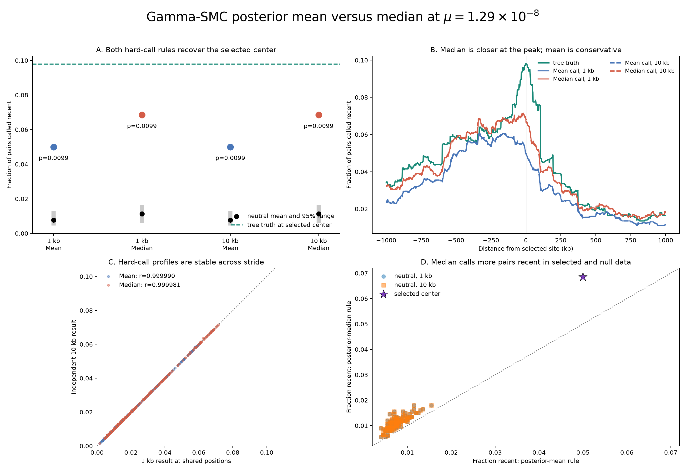

# Posterior mean versus median at 1 kb and 10 kb, mu=1.29e-8

## Answer

Both posterior-summary hard-call rules recover the selected sweep at both
strides. Selection was not previously recovered because of a tenfold mutation
rate typo, not because the decoder used posterior medians.

| Stride | Hard-call rule | Selected center | Null mean | Null 95% range | Exceedances | p |
|---:|---|---:|---:|---:|---:|---:|
| 1 kb | posterior mean | `0.0500` | `0.007715` | `0.0045-0.01276` | 0/100 | `0.009901` |
| 1 kb | posterior median | `0.0685` | `0.011260` | `0.00624-0.01650` | 0/100 | `0.009901` |
| 10 kb | posterior mean | `0.0500` | `0.007715` | `0.0045-0.01276` | 0/100 | `0.009901` |
| 10 kb | posterior median | `0.0685` | `0.011265` | `0.00624-0.01650` | 0/100 | `0.009901` |

Tree-sequence truth at the selected center is `196/2,000=0.098`. The median
rule is closer at that peak, but it also calls more neutral pairs recent. The
selected-to-null-mean ratio is `6.48` for mean calls and `6.08` for median
calls, and both rules have the same finite-null p-value.

## What the call rule changes

`--recent-call` changes only the hard pair classification used for
`n_recent_4500` and `frac_recent_4500`:

- Mean rule: call a pair recent when its posterior mean TMRCA is below 4,500
  years.
- Median rule: call a pair recent when its posterior median TMRCA is below
  4,500 years.

The posterior-probability and posterior-mean-TMRCA columns are exactly
identical between paired mean and median decodes for all selected and null
rows at both strides. The soft statistic therefore remains:

| Stride | Selected mean P(recent) | Null mean | Exceedances | p |
|---:|---:|---:|---:|---:|
| 1 kb | `0.065621` | `0.022703` | 0/100 | `0.009901` |
| 10 kb | `0.065700` | `0.022745` | 0/100 | `0.009901` |

This soft posterior probability is still the recommended primary scan
statistic because it retains uncertainty and does not require choosing one
hard posterior summary.

## Accuracy against tree truth

| Stride | Rule | Bias | MAE | RMSE | Pearson r |
|---:|---|---:|---:|---:|---:|
| 1 kb | mean | `-0.00172` | `0.00347` | `0.00679` | `0.95758` |
| 1 kb | median | `+0.00301` | `0.00487` | `0.00610` | `0.96760` |
| 10 kb | mean | `-0.00171` | `0.00346` | `0.00677` | `0.95755` |
| 10 kb | median | `+0.00303` | `0.00486` | `0.00610` | `0.96745` |

Median calls better reproduce the peak and have lower RMSE and higher
correlation. Mean calls have lower absolute bias and MAE across the complete
10 Mb profile because they avoid some background overcalling. The choice
depends on whether peak sensitivity or average absolute calibration is more
important; it does not change the selection conclusion here.

## Stride comparison

At the 1,000 positions shared between the independent 1 kb and 10 kb studies:

- Mean-call profiles have Pearson `r=0.999990`; 988/1,000 positions are
  identical and the largest difference is one pair (`0.0005`).
- Median-call profiles have Pearson `r=0.999981`; 973/1,000 positions are
  identical and the largest difference is two pairs (`0.0010`).
- The selected-center hard-call fractions are exactly identical at both
  strides.

Across 100,000 shared neutral-replicate positions, correlations are `0.99964`
for mean calls and `0.99970` for median calls. Thus the 10 kb stride does not
explain selection recovery or failure.

## Pointwise multiple testing

The hard-call scans have broad, dense signals:

| Stride | Rule | Raw p<0.05 windows | BH q<0.05 windows |
|---:|---|---:|---:|
| 1 kb | mean | 3,457 | 2,905 |
| 1 kb | median | 3,487 | 2,788 |
| 10 kb | mean | 343 | 292 |
| 10 kb | median | 347 | 279 |

Unlike the softer scan, enough hard-call windows pile up at the minimum
finite-null p-value for the BH step-up threshold to cross. These windows are
highly spatially correlated and form broad regions, so their counts should
not be treated as independent evidence or used alone to select a call rule.
The prespecified center test and matched null calibration remain the clearest
comparison.

## Matched run contract

- Mutation rate: `1.29e-8`; decoder scaling: `theta=0.000516`,
  `rho/theta=0.7751937984`.
- Same retained selected genealogy as the corrected study: additive `s=0.05`,
  population AF `0.3216`, sampled AF `0.31125`, age 180 generations, 2,000
  diploid samples, and 10 Mb.
- Each stride independently regenerated the same deterministic 100 neutral
  replicates and decoded every selected/null VCF twice.
- Both runs used 12 workers, one decoder thread per replicate, and the 1 kb
  cache.
- The paired 1 kb study took `606.1 s`; the paired 10 kb study took `539.5 s`.

## Reproducibility

- [`run_manifest.json`](run_manifest.json) records both exact run commands and
  the source configuration.
- [`analysis/audit.json`](analysis/audit.json) records an independent
  recomputation of dimensions, centers, null exceedances, p-values, soft
  invariance, stride agreement, and file hashes.
- [`analysis/mean_median_stride_center_summary.tsv`](analysis/mean_median_stride_center_summary.tsv)
  is the compact six-row summary including the soft control.
- [`analysis/mean_median_stride_metrics.json`](analysis/mean_median_stride_metrics.json)
  contains paired rule effects and cross-stride agreement.
- Each stride directory retains selected and all 100 null profiles for both
  call rules, pointwise calibrations, significant regions, decoder metadata,
  and its standalone comparison plot.
