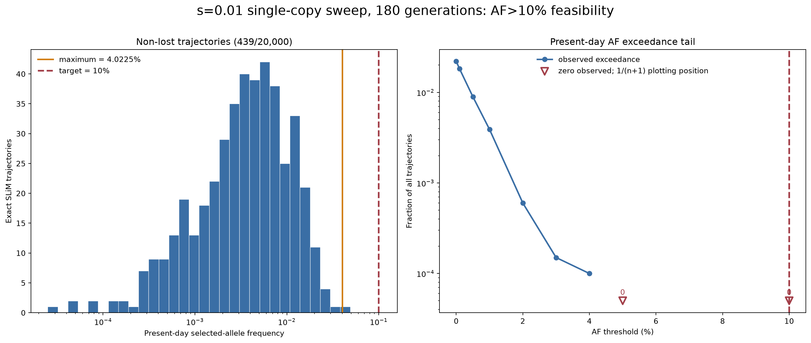

# s=0.01, present-day AF >10% feasibility test

## Result

No qualifying selected genealogy was found. Across 20,000 exact,
seed-ordered SLiM trajectories, zero reached a present-day population allele
frequency of 10%:

| Quantity | Result |
|---|---:|
| Exact SLiM attempts | 20,000 |
| Lost by the present | 19,561 (97.805%) |
| Still segregating | 439 (2.195%) |
| AF >1% | 77 (0.385%) |
| AF >2% | 11 (0.055%) |
| AF >3% | 2 (0.010%) |
| AF >4% | 1 (0.005%) |
| AF >5% | 0 |
| AF >=10% | 0 |
| Maximum AF | 4.0225% (attempt 4,141) |

The one-sided 95% binomial upper bound from zero qualifying outcomes is
`0.0001498` per trajectory. This bound is conservative; the observed AF tail
already ends below 5%.

## Interpretation

This is a trajectory-feasibility failure, not a Gamma-SMC power failure.
Because no selected genealogy met the requested AF conditioning, no 10 kb
posterior-mean/median decode or neutral calibration was run.

All other inherited criteria were retained: a single selected copy introduced
180 generations ago, dominance `h=0.5`, ancestral size 10,000, present size
20,000 after growth 100 generations ago, 2,000 sampled diploids, 10 Mb, and
the corrected mutation-rate contract `mu=1.29e-8`. Mutation rate does not
affect the rejection trajectory itself, but it would govern mutation overlay
and decoding after a trajectory was accepted.

The paired seed is informative. Attempt 1,468 reached population AF `0.3216`
under `s=0.05` in the prior corrected study, but only `0.03025` under
`s=0.01`. Thus the weaker coefficient, rather than output stride or posterior
summary, prevents this 180-generation single-copy model from producing a
common selected allele.

## Scientifically defensible next designs

To test Gamma-SMC at `s=0.01` and present-day AF >10%, one biological
assumption must change:

1. Use selection on standing variation, beginning near 4-5% AF and retaining
   the 180-generation/4,500-year scan threshold.
2. Use an older single-copy origin and decouple allele age from the fixed
   4,500-year recent-coalescence threshold.

An unconstrained increase in rejection attempts would select an exceptionally
rare trajectory and make the result highly conditional.

## Reproducibility

- `source/selected_rejection_screen_contract.json` is the validated run
  contract.
- `source/selected_rejection_attempts.tsv` contains all 20,000 exact
  trajectories and deterministic seeds.
- `analysis/screen_summary.json` records independently validated counts,
  hashes, and the zero-event bound.
- `analysis/af_exceedance_counts.tsv` and
  `analysis/top_20_trajectories.tsv` provide compact QC tables.
- `scripts/analyze_high_af_rejection_screen.py` regenerates the audit and
  figure.

