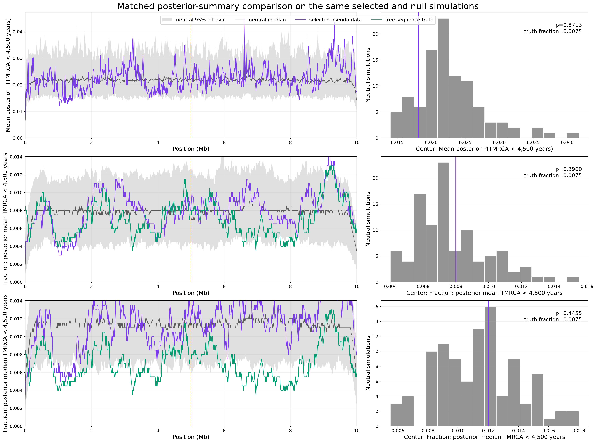
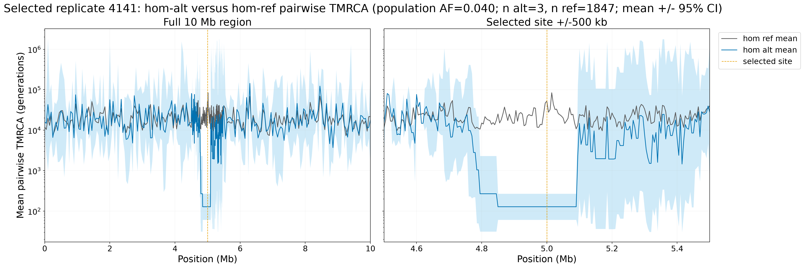

# Exact `s=0.01`, AF 4.0225% selected-run decode

## Conclusion

This exact selected replicate is **not significant** in the population-wide
Gamma-SMC scan. That conclusion is unchanged by posterior mean versus median
hard calls, the soft posterior statistic, a center test, BH correction, or a
simulation-calibrated regional-density test.

| Statistic | Selected center | Null mean | Null 95% range | Exceedances | Center p |
|---|---:|---:|---:|---:|---:|
| Soft posterior probability | `0.018095` | `0.022745` | `0.014925-0.035784` | 87/100 | `0.8713` |
| Posterior-mean hard call | `0.0080` | `0.007715` | `0.004500-0.012763` | 39/100 | `0.3960` |
| Posterior-median hard call | `0.0120` | `0.011265` | `0.006238-0.016500` | 44/100 | `0.4455` |

The tree-sequence truth at the selected center is also not unusual relative
to the matched neutral simulations: `15/2,000=0.0075` pairs coalesce within
180 generations, with 35/100 neutral exceedances and `p=36/101=0.3564`.
Thus this result is not a case where a strong aggregate tree-truth signal was
lost by the decoder.

## Regional and multiple-testing checks

| Statistic | Raw p<0.05 windows | BH q<0.05 | Global density p | +/-500 kb positives | Local density p |
|---|---:|---:|---:|---:|---:|
| Soft posterior probability | 52/1,000 | 0 | `0.2574` | 2/101 | `0.5446` |
| Posterior-mean hard call | 38/1,000 | 0 | `0.3069` | 0/101 | `1.0000` |
| Posterior-median hard call | 57/1,000 | 0 | `0.2376` | 0/101 | `1.0000` |

The soft scan has two nominal local windows at 4.80 and 4.81 Mb
(`p=0.0198`), 190-200 kb left of the selected site. They have `q=0.8783`,
and two local positives are fewer than the neutral leave-one-out mean of
4.04, yielding the nonsignificant local-density p-value above. The hard-call
scans have no nominally positive window within +/-500 kb. Nominal windows
elsewhere in the 10 Mb region are not enriched relative to neutral scans.

One hundred nulls give a minimum attainable Monte Carlo p-value of
`1/101=0.00990`, which is sufficient for the prespecified center and density
tests at alpha 0.05. The observed center ranks are far from that resolution
limit. As in the earlier studies, BH across 1,000 windows is a more stringent
question; here no statistic passes it.

## Why the hom-alt contrast is visible but the scan is null

The carrier-conditioned tree contrast is real but extremely sparse:

| Pair class | n | Center mean TMRCA (generations) |
|---|---:|---:|
| Hom-alt | 3 | `128.3` |
| Hom-ref | 1,847 | `52,561.6` |

At population AF `0.040225`, Hardy-Weinberg sampling predicts about
`2,000 * AF^2 = 3.24` hom-alt individuals, matching the three observed.
Those three constitute only 0.15% of the 2,000 within-individual pairs. The
aggregate tree truth is therefore only slightly above the neutral theoretical
recent fraction (`0.0075` versus `0.006479`) and is empirically
nonsignificant. The previous `s=0.05`, AF approximately 31% source had 194
hom-alt pairs and a 9.8% aggregate recent fraction, so it presented a much
stronger population-wide target. The evidence here points to the realized
aggregate genealogy and carrier count, and changing the posterior call rule
does not rescue the AF4 scan. The 10 kb grid contains the selected site
exactly; an AF4-specific 1 kb rerun was not performed in this study.

## Exact run contract

- Selected source: deterministic attempt 4,141 (zero-based), seed 972187,
  from base seed 930777.
- Additive selection coefficient `s=0.01`; population AF `0.040225`; sample
  AF `0.039`; allele age 180 generations.
- Mutation rate `1.29e-8`; recombination rate `1e-8`; 10 Mb; 2,000 diploid
  samples; ancestral/present population sizes 10,000/20,000.
- Native optimized Gamma-SMC decoder; 10 kb output stride; 1 kb cache;
  12 workers; one decoder thread per replicate.
- One selected profile and 100 deterministic matched neutral replicates,
  each decoded with posterior-mean and posterior-median calls. The paired
  soft-posterior columns are identical to tolerance `1e-12`.
- Complete paired decode elapsed time: `506.25 s`.

## Reproducibility files

- `run_manifest.json`: exact source, decoder settings, commands, seeds, and
  software versions.
- `analysis/significance_summary.tsv`: compact center, pointwise, BH, and
  density results for all three statistics.
- `analysis/audit.json`: independent profile-level recomputation, dimensions,
  contract assertions, and SHA-256 hashes.
- `stride10kb/`: complete selected and 100-null profiles, calibrations,
  significant-region tables, plots, and decoder metadata.
- `source/`: retained tree sequence, VCF, allele-frequency trajectory,
  carrier table, tree-truth profiles, and source metrics.

No controlled All of Us data were used; all results are synthetic.
