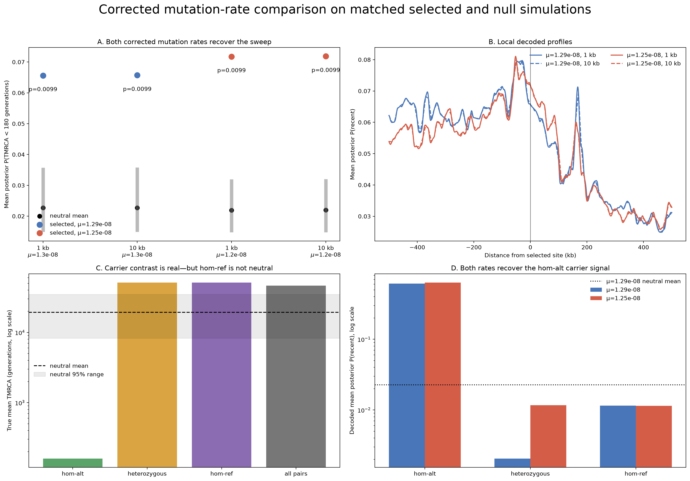

# Corrected mutation-rate evaluation: 1.29e-8 versus 1.25e-8

## Answer

Selection is recovered at the intended mutation rate. The earlier `1.29e-9`
run was a tenfold sparse-mutation sensitivity experiment caused by a decimal
place error; it is not evidence that Gamma-SMC fails under the intended
default.

The paired posterior mean-versus-median follow-up at both 1 kb and 10 kb is in
[`../gamma_smc_mu1p29e8_mean_vs_median_strides_seed930777/RESULTS.md`](../gamma_smc_mu1p29e8_mean_vs_median_strides_seed930777/RESULTS.md).

With the same selected genealogy and matched decoder scaling, both
`mu=1.29e-8` and `mu=1.25e-8` recover the sweep at both 1 kb and 10 kb output
stride:

| Mutation rate | Stride | Selected center | Null mean | Null 95% range | Exceedances | p |
|---:|---:|---:|---:|---:|---:|---:|
| `1.29e-8` | 1 kb | `0.065621` | `0.022703` | `0.014894-0.035730` | 0/100 | `0.009901` |
| `1.29e-8` | 10 kb | `0.065700` | `0.022745` | `0.014925-0.035784` | 0/100 | `0.009901` |
| `1.25e-8` | 1 kb | `0.071757` | `0.021938` | `0.014785-0.031986` | 0/100 | `0.009901` |
| `1.25e-8` | 10 kb | `0.071845` | `0.021981` | `0.014811-0.032044` | 0/100 | `0.009901` |

The statistic is the mean across within-individual pairs of the posterior
probability `P(TMRCA < 180 generations)`. All corrected runs explicitly use
`--recent-call mean`; that option controls the separate hard-call columns and
does not alter this primary soft-posterior statistic.

## What explains the previous result?

It was not the 1 kb stride. Within each mutation-rate overlay, the selected
1 kb and 10 kb profiles are nearly identical:

- `mu=1.29e-8`: Pearson `r=0.9999979`; the center changes by `0.12%`.
- `mu=1.25e-8`: Pearson `r=0.9999975`; the center changes by `0.12%`.

The corrected 10 kb run therefore retains the selected signal while reducing
the selected profile from 10,000 to 1,000 positions. Wall time remained
similar (`378.95 s` at 1 kb and `375.43 s` at 10 kb) because posterior output
resolution is not the dominant cost in this 2,000-pair, 100-null study.

The failed run used only 5,483 sites at `1.29e-9`. The corrected overlay has
55,097 sites at `1.29e-8`, and the existing comparison overlay has 53,528
sites at `1.25e-8`. Thus the earlier result tested information loss after an
approximately tenfold reduction in mutations, not the intended difference
between two close human mutation-rate estimates.

## Is the p-value underpowered?

Not for the prespecified center or regional-density tests in this simulation.
No decoded null center is as large as the selected center in any of the four
cells. With 100 nulls the finite-null upper-tail estimate is
`(0+1)/(100+1)=0.009901`; for the corrected 1.29e-8, 10 kb cell, the exact 95%
Clopper-Pearson interval for the underlying exceedance probability is
`0-0.0362`.

The selected scan is also regionally enriched:

| Mutation rate | Stride | Global positive windows (selected / null mean) | Local +/-500 kb (selected / null mean) | Density p |
|---:|---:|---:|---:|---:|
| `1.29e-8` | 1 kb | `2499 / 400.0` | `876 / 40.04` | `0.009901` |
| `1.29e-8` | 10 kb | `246 / 40.0` | `88 / 4.04` | `0.009901` |
| `1.25e-8` | 1 kb | `2467 / 400.0` | `863 / 40.04` | `0.009901` |
| `1.25e-8` | 10 kb | `250 / 40.0` | `86 / 4.04` | `0.009901` |

There are no BH discoveries across the full position-by-position scan. That
is a calibration-resolution issue, not absence of a signal: with 100 nulls,
the smallest attainable empirical p-value is `1/101`. An isolated minimum
p-value cannot pass BH across 1,000 or 10,000 windows; crossing at that value
would require at least 199 or 1,981 windows, respectively, at or below it.
The observed p-value distributions do not meet that condition. The
prespecified center and null-calibrated regional-density tests are the
appropriate evidence here. More nulls would be needed for a powered
genome-wide multiple-testing analysis.

## Carrier-class check

The tree-sequence truth shows exactly the expected genotype contrast at the
selected center:

| Pair class | Pairs | Truth recent fraction | Truth mean TMRCA |
|---|---:|---:|---:|
| homozygous reference | 949 | `0.00211` | `51,272.7` generations |
| heterozygous | 857 | `0` | `51,287.1` generations |
| homozygous alternate | 194 | `1.0` | `159.9` generations |

Gamma-SMC recovers the homozygous-alternate contrast at both rates. Its center
posterior recent probability is `0.6118` at `1.29e-8` and `0.6333` at
`1.25e-8`, versus approximately `0.0115` for homozygous-reference pairs.
This directly confirms that the visible carrier-class TMRCA difference is
present in the decoded result.

The homozygous-reference class is not itself a neutral null. Conditioning on
the selected allele partitions lineages at the focal locus: homozygous-
reference truth has mean TMRCA `51,272.7` generations, whereas the mean across
the 100 unconditioned neutral truth replicates is `19,376.7` generations.
Accordingly, the formal comparison must use matched neutral simulations rather
than treating selected-simulation homozygous-reference pairs as exchangeable
with neutral pairs. The aggregate selected statistic still exceeds every
matched decoded null.

## Design and interpretation

- Selected criteria are unchanged: additive `s=0.05`, population AF
  `0.3216` (minimum `0.30`), sampled AF `0.31125`, allele age 180
  generations, 2,000 diploid samples, and a 10 Mb region.
- Both overlays use the same 39,515-tree, 4,000-haplotype ancestry. After
  removing sites, mutations, and provenance, their table collections are
  exactly equal.
- The corrected `1.29e-8` overlay used binary mutations with seed 945460 and
  decoder parameters `theta=0.000516` and `rho/theta=0.7751937984`.
- Each of the four cells is a complete, independently decoded 100-null
  calibration. The new cells used 12 workers, one decoder thread per
  replicate, a 1 kb cache, and posterior-mean hard calls.
- The `1.25e-8` cells are the already-complete matched runs in
  `../gamma_smc_stride_mutation_hypotheses_seed930777/high_mu_stride1kb` and
  `high_mu_stride10kb`; they were re-audited rather than duplicated.
- The neutral-truth directory retains an older `mu1p29e9` name, but this
  analysis reads only mutation-independent tree-sequence TMRCA truth from it.
  All decoded nulls in the four test cells use their stated, matched mutation
  rate.

The corrected overlay has 3.2% higher mutation rate and 2.93% more sites than
the 1.25e-8 overlay, yet its selected-center statistic is 8.55% lower. Because
there is one independent mutation realization per rate, this difference
should not be interpreted as a precise mutation-rate effect. It is
mutation-realization noise plus any small rate effect. The robust result is
that both rates strongly recover the same selected genealogy.

## Reproducibility

- [`run_manifest.json`](run_manifest.json) records inputs, seeds, scaling,
  commands, worker count, and software versions.
- [`analysis/audit.json`](analysis/audit.json) records an independent
  recomputation of dimensions, center statistics, exceedances, p-values,
  genealogy equality, and SHA-256 hashes.
- [`analysis/stride_mutation_factorial_center.tsv`](analysis/stride_mutation_factorial_center.tsv)
  is the compact four-cell result table.
- [`analysis/hypothesis_test_summary.json`](analysis/hypothesis_test_summary.json)
  contains stride and fixed-stride mutation-rate comparisons.
- Per-position selected profiles, all 100 null profiles, spatial calibrations,
  plots, and decoder run metadata are retained in each new result directory.
